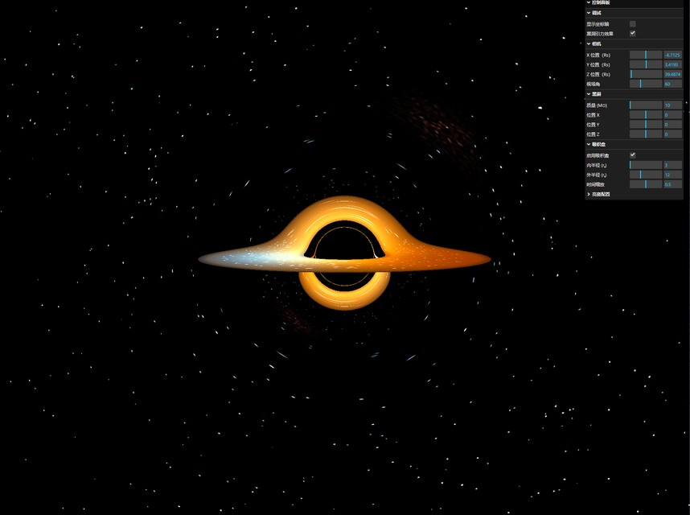

# 黑洞物理现象可视化 3D 模拟

科学级的交互式黑洞模拟软件，基于广义相对论实现，在浏览器中实时渲染黑洞的引力透镜、吸积盘、多普勒效应等物理现象。

## 效果演示



## 技术栈

- **核心框架**: Three.js (r160+)
- **编程语言**: TypeScript
- **构建工具**: Vite
- **UI库**: lil-gui
- **物理引擎**: 自研（基于广义相对论 Schwarzschild 度规）

## 核心功能

### 1. 广义相对论光线追踪

基于测地线积分实现的光线追踪算法，精确模拟光线在强引力场中的弯曲：

- **测地线积分**: 笛卡尔坐标下的数值积分，每步更新位置和方向向量
- **引力加速度**: 基于 Schwarzschild 度规计算：$\vec{a} = -\frac{3GMh^2}{c^2r^5}\vec{r}$
- **自适应步长**: 接近黑洞时自动减小步长，提高精度
- **光线终止条件**:
  - 进入事件视界（r ≤ rₛ）→ 黑色
  - 逃逸到足够远（r > 50rₛ）→ 采样星空
  - 超过最大步数 → 采样星空

### 2. 黑洞可视化

- **事件视界**: 完全黑暗的球形区域
- **史瓦西半径**: $r_s = \frac{2GM}{c^2}$，根据质量动态计算
- **质量范围**: 1 - 10,000,000 太阳质量
- **实时交互**: 支持质量、位置参数动态调整

### 3. 星空背景

程序化生成的星空环境，为光线追踪提供背景纹理：

**技术实现**:

- **球面投影法**: 在 3D 球面上随机生成星星，投影到立方体 6 个面
- **Cube Map 纹理**: 2048×2048 分辨率，SRGB 色彩空间
- **光晕效果**: 使用径向渐变模拟星星的光晕

**星星特性**:

- **数量**: 5000 颗
- **颜色**: 蓝白色、白色、暖白色三种恒星光谱
- **亮度**: 0.3 - 1.0 随机分布
- **大小**: 0.5 - 1.5 像素

### 4. 星云背景

基于真实物理数据的程序化星云生成系统：

**技术实现**:

- **域扭曲算法**: 多层噪声嵌套制造湍流和气体流动效果
- **分形布朗运动 (FBM)**: 6 层噪声叠加，生成细腻纹理
- **Simplex 噪声**: 3D 噪声函数生成自然随机性
- **Cube Map 纹理**: 512×512 分辨率，每面独立生成一片星云

**星云特性**:

- **数量**: 6 团（每立方体面一团）
- **大小**: 0.12 - 0.2 弧度（约 7° - 11°）
- **分布**: 以各面中心为基准，±0.3 范围随机偏移

**真实色彩主题**:

- **猎户座大星云型 (M42)**: Hα 红色 + OIII 蓝绿色发射
- **鹰状星云型 (M16)**: Hα 红色发射星云
- **礁湖星云型 (M8)**: Hα 和 SII 混合（红紫色）
- **北美洲星云型 (NGC 7000)**: 红色发射星云
- **螺旋星云型**: OIII 强发射（蓝绿色行星状星云）

**视觉效果**:

- 气体扩散边缘渐隐（1.2 次幂衰减）
- 强度范围 0.7 - 1.0，全局亮度倍数 2.5
- 多团星云叠加混合，支持星云强度调节 [0, 1]

### 5. 吸积盘模拟

采用体积渲染方案，在光线追踪过程中检测吸积盘平面：

#### 5.1 几何特性

- **位置**: 位于 xz 平面（黑洞黄道面）
- **内半径**: 3rₛ（最内稳定圆轨道 ISCO）
- **外半径**: 可调节（8-20rₛ）
- **厚度**: 零厚度（平面模型）

#### 5.2 程序化纹理

多层噪声生成真实吸积盘纹理：

- **粗糙纹理**: 大尺度结构（FBM，低频噪声）
- **细节纹理**: 小尺度细节（FBM，高频噪声）
- **径向噪声**: 增加径向变化
- **螺旋臂**: 模拟吸积流形成的螺旋结构
- **径向条纹**: 模拟物质吸积过程

#### 5.3 动态效果

- **开普勒旋转**: 基于物理公式 $v = c\sqrt{\frac{r_s}{2r}}$
- **差分旋转**: 内圈快、外圈慢（开普勒第三定律）
- **时间缩放**: 可调节旋转速度（0.0001x - 1.0x）

#### 5.4 多普勒效应

基于相对论多普勒公式实现：

$$D = \frac{1}{\gamma(1 - \beta \cos\theta)}$$

- **蓝移**: 朝向观察者运动的部分 → 颜色偏蓝，亮度增强
- **红移**: 远离观察者运动的部分 → 颜色偏红，亮度减弱
- **速度范围**: 在 3-8rₛ 范围内约为光速的 25% - 41%
- **频率变化**: +53%（蓝移）到 -35%（红移）

#### 5.5 亮斑系统

模拟吸积盘中的高温物质团块：

**物理特性**:

- **数量**: 300 个（可调节 0-1000）
- **分布**: 内圈密集、外圈稀疏（符合物理规律）
- **尺寸**: 5.0（可调节 0.1-10）
- **亮度**: 1.0（可调节 0.1-5）

**动态效果**:

- **差分旋转**: 每个亮斑根据轨道半径独立旋转（开普勒轨道）
- **椭圆形状**: 沿切线方向拉伸 2 倍，模拟高速运动拖尾
- **脉动效果**: 缓慢明暗变化（2-5 次/秒）
- **闪烁效果**: 高频亮度波动（10-25 次/秒）
- **内圈更亮**: 亮度增强 50%

### 6. 交互控制

#### 相机控制

- **3D 自由视角**: OrbitControls 轨道控制器
- **位置调节**: X/Y/Z 三轴独立控制（单位：rₛ）
- **视场角**: 可调节 FOV（默认 60°）

#### GUI 控制面板

**调试面板**:

- 显示/隐藏坐标轴
- 启用/禁用黑洞引力效果

**相机面板**:

- X/Y/Z 位置调节
- FOV 调节

**黑洞面板**:

- 质量（1 - 10,000,000 M☉）
- 位置（X/Y/Z）

**吸积盘面板**:

- 启用/禁用吸积盘
- 内半径（3-6 rₛ）
- 外半径（8-20 rₛ）
- 时间缩放（控制旋转速度）
- 亮斑配置:
  - 数量（0-1000）
  - 尺寸（0.1-10）
  - 亮度（0.1-5）

## 物理准确性

本项目严格遵循物理定律，无任何人为调节参数（除 UI 控制外）：

1. **光线弯曲**: 基于 Schwarzschild 度规的测地线方程
2. **轨道速度**: 开普勒公式 $v = \sqrt{GM/r}$
3. **多普勒效应**: 相对论公式，无任何经验参数
4. **角速度**: 开普勒第三定律 $\omega \propto r^{-3/2}$

## 安装与运行

### 安装依赖

```bash
npm install
```

### 启动开发服务器

```bash
npm run dev
```

### 构建生产版本

```bash
npm run build
```

## 性能优化

- **自适应步长**: 根据距离黑洞的远近自动调整积分步长
- **最大步数限制**: 默认 500 步，平衡精度与性能
- **Uniform 变量**: 所有参数通过 GPU uniform 传递，避免 CPU-GPU 同步
